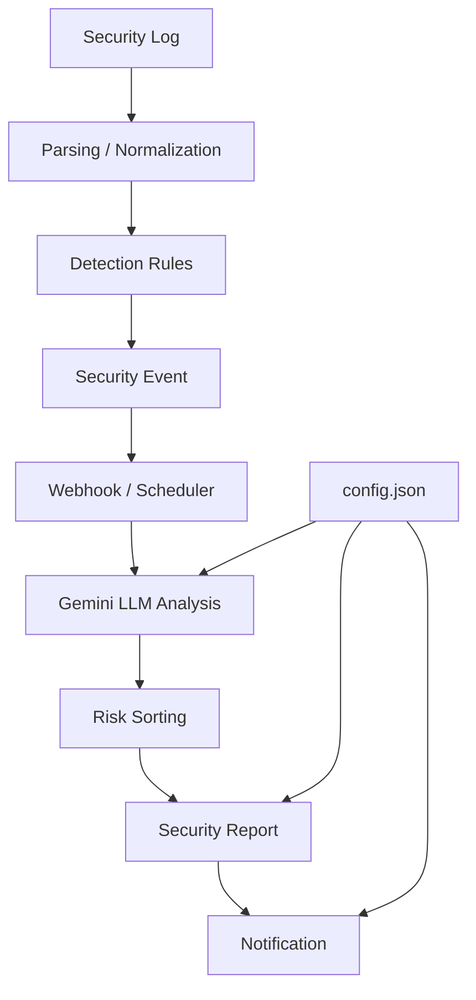

# Security Agent Toolkit

Python과 LLM을 활용해 보안 로그와 경보를 분석하고,  
결과를 요약·정리하여 보안 관제 보고서로 만드는 과정을 실습하는 프로젝트입니다.

---

## 주요 내용

- 다양한 형식의 보안 로그 파싱 및 정규화
- 정규표현식과 탐지 규칙을 이용한 이상 행위 탐지
- 외부 API를 이용한 데이터 조회 및 예외 처리
- Flask Webhook을 이용한 실시간 경보 수신
- 중복 경보 방지 및 스케줄 기반 자동 실행
- Gemini API를 활용한 보안 경보 요약 및 위험도 분류
- high / medium / low 기준의 경보 정렬
- Markdown 형식의 보안 관제 보고서 자동 생성
- 설정 파일을 이용한 실행 환경 및 정책 분리
- 보고서 생성부터 알림까지 하나의 파이프라인으로 연결
- assert와 테스트 코드를 이용한 결과 검증 및 디버깅
  
---

## Pipeline

---

## 📁 Main Files

| 파일 | 설명 |
| --- | --- |
| `log_parser.py` | 로그 파싱 및 예외 처리 |
| `normalize_logs.py` | 서로 다른 로그 형식 정규화 및 JSON 저장 |
| `api_client.py` | 외부 API 요청 및 응답 처리 |
| `webhook_server.py` | Flask 기반 보안 경보 수신 서버 |
| `scheduler_job.py` | 경보 처리 작업의 주기적 실행 |
| `llm_client.py` | Gemini API 호출 및 JSON 응답 처리 |
| `tool_router.py` | LLM이 선택한 도구를 실제 함수와 연결 |
| `event_summarizer.py` | 경보 묶음 요약 및 위험도 정렬 |
| `report_generator.py` | 보안 관제 보고서 생성 |
| `config.json` | 모델, 정책, 저장 위치, 알림 주소 설정 |
| `notifier.py` | 사람 확인 대상 판정 및 알림 전송 |
| `pipeline.py` | 분석부터 보고·알림까지 전체 과정 실행 |
| `test_agent_core.py` | 주요 기능 및 결과 검증 |

---

## 📚 Learning Log

| 날짜 | 학습 내용 |
| --- | --- |
| `2026-09-22` | Python 변수, 자료형, 리스트, 딕셔너리, f-string |
| `2026-09-23` | 조건문, 반복문, 데이터 집계, 함수 및 파일 처리 |
| `2026-09-28` | 예외처리, Logging, JSON, 로그 정규화 |
| `2026-09-29` | 정규표현식, 보안 탐지 룰, API·HTTP 기초 |
| `2026-09-30` | Requests를 이용한 API 호출, timeout, 재시도, 환경변수 |
| `2026-10-02` | Flask Webhook, CLI, 중복 처리, 스케줄러 |
| `2026-10-06` | Gemini API, 프롬프트, AI 도구 호출 및 승인 처리 |
| `2026-10-07` | 경보 묶음 요약, 위험도 정렬, 관제 보고서 생성 |
| `2026-10-08` | 설정 분리, 알림 연동, 파이프라인 구성, 테스트 및 디버깅 |
