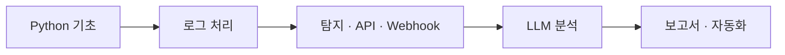

# agent_core

`agent_core`는 Security Agent Toolkit의 학습 코드와 실행 로직을 모아 둔 핵심 작업 폴더입니다.

Python 기초 문법부터 시작해 로그 처리, 탐지 규칙, API, Webhook, LLM 분석, 보고서 생성, 알림 및 파이프라인 구성까지 단계적으로 구현한 실습 내용을 포함합니다.

---

## 📌 학습 흐름

---

## 📚 파일별 학습 활동

| 날짜 | 실습 파일 | 주요 활동 |
| --- | --- | --- |
| `2026-09-22` | [`260922_variables_and_lists.ipynb`](./260922_variables_and_lists.ipynb) | Python 변수와 자료형을 익히고, 리스트·딕셔너리에 보안 로그 데이터를 저장하고 조회하는 기초 실습을 진행 |
| `2026-09-23` | [`260923_am_conditions_loops_counting.ipynb`](./260923_am_conditions_loops_counting.ipynb) | 조건문과 반복문을 이용해 로그인 성공·실패 로그를 판별하고 계정별 실패 횟수를 집계 |
| `2026-09-23` | [`260923_extra_challenges.ipynb`](./260923_extra_challenges.ipynb) | 앞에서 학습한 Python 문법을 활용한 추가 문제와 응용 실습 진행 |
| `2026-09-23` | [`260923_pm_functions_files_csv.ipynb`](./260923_pm_functions_files_csv.ipynb) | 반복되는 로그 처리 코드를 함수로 분리하고, 파일에서 로그 데이터를 읽고 저장하는 방법을 실습 |
| `2026-09-28` | [`260928_am_exceptions_logging.ipynb`](./260928_am_exceptions_logging.ipynb) | `try / except`와 Logging을 이용해 잘못된 로그가 포함되어 있어도 중단되지 않는 로그 파서 구현 |
| `2026-09-28` | [`260928_pm_nested_json.ipynb`](./260928_pm_nested_json.ipynb) | 중첩 리스트·딕셔너리와 JSON을 다루고, 서로 다른 형식의 로그를 하나의 구조로 정규화 |
| `2026-09-29` | [`260929_am_regex_detection_rules.ipynb`](./260929_am_regex_detection_rules.ipynb) | 정규표현식으로 서버 로그에서 계정·IP·이벤트 정보를 추출하고 브루트포스 및 의심 IP 탐지 규칙 적용 |
| `2026-09-29` | [`260929_pm_rules_api.ipynb`](./260929_pm_rules_api.ipynb) | 심야 로그인 성공 등 추가 탐지 규칙을 만들고 URL, HTTP Method, 상태 코드, 인증 방식 등 API 기초 학습 |
| `2026-09-30` | [`260930_am_requests_api_client.ipynb`](./260930_am_requests_api_client.ipynb) | `requests`로 외부 API를 호출하고 `timeout`, 상태 코드 확인, 재시도, `.env`를 이용한 API 요청 처리 |
| `2026-10-02` | [`261002_am_webhook_cli.ipynb`](./261002_am_webhook_cli.ipynb) | Flask로 Webhook 수신 서버를 만들고 `curl`과 CLI를 이용해 실제 HTTP 요청을 보내고 수신하는 과정 실습 |
| `2026-10-02` | [`261002_pm_trigger_scheduler.ipynb`](./261002_pm_trigger_scheduler.ipynb) | Trigger → Condition → Action 구조를 이해하고 중복 경보 방지와 Scheduler를 이용한 자동 실행 구현 |
| `2026-10-06` | [`261006_am_llm_prompt.ipynb`](./261006_am_llm_prompt.ipynb) | Gemini API를 호출해 보안 로그를 자연어로 분석하고, 프롬프트를 구성해 JSON 형태의 응답을 받도록 구현 |
| `2026-10-06` | [`261006_pm_agent_tools.ipynb`](./261006_pm_agent_tools.ipynb) | LLM이 필요한 도구를 선택하게 하고 Tool Router를 통해 실제 함수를 실행하며 위험 작업에는 승인 절차 적용 |
| `2026-10-07` | [`261007_am_report_summary.ipynb`](./261007_am_report_summary.ipynb) | 여러 보안 경보를 묶음으로 LLM에 전달해 요약하고 `high / medium / low` 위험도로 분류·정렬 |
| `2026-10-07` | [`261007_pm_report_generator.ipynb`](./261007_pm_report_generator.ipynb) | 경보 전체의 총평을 생성하고 경보 건수, 조건부 경고, 건별 내역을 포함한 Markdown 보안 관제 보고서 구현 |
| `2026-10-08` | [`261008_am_config_pipeline.ipynb`](./261008_am_config_pipeline.ipynb) | 모델·정책·알림 주소를 `config.json`으로 분리하고 보고서 생성과 알림 기능을 `pipeline.py`로 통합 |
| `2026-10-08` | [`261008_pm_review_debug_retro.ipynb`](./261008_pm_review_debug_retro.ipynb) | `assert` 기반 테스트, 코드 리뷰, 문법·실행·논리 오류 디버깅을 진행하고 전체 파이프라인 동작을 최종 점검 |
