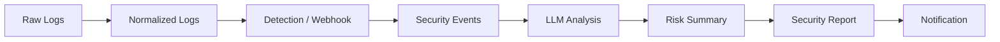

# artifacts

`artifacts`는 Security Agent Toolkit 실습 과정에서 생성한 코드, 테스트 데이터, JSON 결과, 보안 관제 보고서 등의 산출물을 모아 둔 폴더입니다.

`agent_core`에서 구현하고 실행한 기능들이 실제로 어떤 데이터를 입력받고 어떤 결과를 만들어 냈는지 확인할 수 있습니다.

---

## 📌 산출물 흐름

---

## 📂 주요 데이터 및 결과

| 파일 | 내용 |
| --- | --- |
| `raw_logs.txt` | 정규표현식과 탐지 룰 실습에 사용한 원본 서버 로그 |
| `normalized_logs.json` | 원본 로그에서 시간, 등급, 사용자, IP 등을 추출해 공통 형식으로 정규화한 결과 |
| `api_result.json` | 의심 IP를 외부 API로 조회한 국가 및 ISP 정보 |
| `received_alerts.json` | Flask Webhook 서버가 실제로 수신한 경보 기록 |
| `processed_ids.json` | Scheduler 실행 시 이미 처리한 경보를 기록하여 중복 처리를 방지하기 위한 데이터 |
| `events_1007.json` | 10/7 LLM 분석 및 보고서 생성에 사용한 보안 경보 데이터 |
| `events_1008.json` | 10/8 Pipeline 실행에 사용한 보안 경보 데이터 |
| `event_summaries.json` | Gemini가 보안 경보를 요약하고 위험도를 분류한 결과 |
| `sorted_summaries.json` | 경보 요약을 `high → medium → low` 순으로 정렬한 결과 |
| `agent_result.json` | AI Agent가 선택한 도구와 실행 결과, 승인 대기 결과를 저장한 파일 |

---

## 📄 Security Reports

| 파일 | 내용 |
| --- | --- |
| `daily_report_20261007.md` | 경보 18건을 분석해 생성한 10/7 야간 보안 관제 보고서 |
| `daily_report_20261008.md` | Pipeline을 이용해 생성한 10/8 야간 보안 관제 보고서 |
| `daily_report_20261009.md` | 동일한 Pipeline을 다른 날짜에 실행하여 생성한 관제 보고서 |
| `daily_report_2026-10-08.md` | 날짜 형식을 적용해 생성한 보고서 산출물 |
| `report_test.md` | 보안 경보를 Markdown 보고서 형태로 변환하는 과정에서 사용한 테스트 파일 |

보고서에는 다음 정보가 포함됩니다.

- 처리한 전체 경보 수
- `high` 위험도 경보 수
- 위험 경보 발생 시 조건부 경고
- LLM이 작성한 전체 경보 총평
- `HIGH → MEDIUM → LOW` 순으로 정렬한 건별 내역

---

## ⚙️ 분석 및 자동화 코드

| 파일 | 역할 |
| --- | --- |
| `api_client.py` | 외부 API를 이용한 IP 정보 조회 및 재시도 처리 |
| `llm_client.py` | Gemini API 호출 및 JSON 응답 처리 |
| `tool_router.py` | AI Agent가 선택한 도구 이름을 실제 Python 함수와 연결 |
| `event_summarizer.py` | 여러 보안 경보를 묶음으로 요약하고 위험도순으로 정렬 |
| `report_generator.py` | LLM 총평과 경보 데이터를 이용해 Markdown 관제 보고서 생성 |
| `notifier.py` | 설정을 확인하고 사람의 확인이 필요한 경보를 판정한 뒤 알림 전송 |
| `pipeline.py` | 경보 분석 → 보고서 생성 → 승인 대상 판정 → 알림을 하나의 흐름으로 연결 |
| `scheduler_job.py` | 탐지 작업을 일정한 간격으로 실행하고 중복 경보 처리 방지 |
| `test_agent_core.py` | 주요 함수와 출력 결과를 `assert`로 검증 |

---

## 🔔 Webhook 관련 산출물

| 파일 | 역할 |
| --- | --- |
| `webhook_server.py` | Flask 기반 경보 수신 서버 |
| `webhook_server_pm.py` | Scheduler 실습에서 사용한 Webhook 수신 서버 |
| `alert_server.py` | Pipeline에서 발생한 보고서 알림을 수신하는 서버 |
| `hello_server.py` | 기본적인 Flask Webhook 수신 실습 |
| `echo_server.py` | 받은 요청의 값을 응답으로 돌려주는 Webhook 실습 |
| `count_server.py` | 수신한 경보 개수를 누적하여 반환하는 서버 |
| `save_server.py` | 수신한 경보를 `received_alerts.json`에 저장하는 서버 |
| `test_webhook.sh` | `curl`을 이용해 탐지 경보를 Webhook 서버로 전송하는 테스트 스크립트 |
| `demo_test.sh` | Webhook 요청 전송을 확인하기 위한 간단한 테스트 스크립트 |

---

## ⚙️ Configuration

| 파일 | 용도 |
| --- | --- |
| `config.json` | 기본 모델, 승인 기준, 보고서 폴더, Webhook 주소 설정 |
| `config_low.json` | 승인 기준을 `low`로 변경한 테스트 설정 |
| `config_medium.json` | 승인 기준을 `medium`으로 변경한 테스트 설정 |
| `config_off.json` | 동작하지 않는 Webhook 주소를 사용해 장애 상황을 테스트하기 위한 설정 |
| `config_broken.json` | 필수 설정값이 빠진 상황을 확인하기 위한 테스트 파일 |

설정 파일을 분리하여 Python 코드를 직접 수정하지 않고도 승인 기준이나 알림 주소 등의 동작을 변경할 수 있도록 실습했습니다.

---

## 🧪 실습 및 테스트 파일

| 파일 | 내용 |
| --- | --- |
| `port_demo.py` | `argparse`를 이용해 CLI에서 포트 번호를 전달하는 실습 |
| `notype_demo.py` | CLI 인자의 자료형 지정 여부에 따른 차이 확인 |
| `rule_demo.py` | 포트와 탐지 룰을 CLI 인자로 전달하는 실습 |
| `demo_ids.json` | 중복 처리 로직을 확인하기 위한 테스트 ID 데이터 |
| `test.md` | Markdown 파일 생성 실습 |
| `alert_failures.log` | 알림 처리 과정에서 기록한 로그 |

---

## 🔗 관련 폴더

실제 구현 과정과 학습 코드는 [`agent_core`](../agent_core)에서 확인할 수 있습니다.

날짜별 학습 내용과 회고는 [`docs`](../docs)에서 확인할 수 있습니다.
