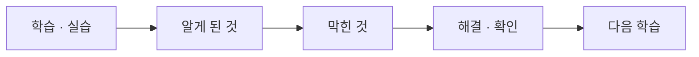

# docs

`docs`는 Security Agent Toolkit을 진행하면서 작성한 날짜별 학습 기록과 회고를 모아 둔 폴더입니다.

단순히 실습 결과만 기록하는 것이 아니라, 새롭게 사용한 명령어와 개념, 실습 중 발생한 문제, 해결 과정과 이후 다시 확인할 내용을 함께 정리했습니다.

---

## 📌 기록 흐름



---

## 📝 Daily Learning Notes

| 날짜 | 문서 | 주요 기록 |
| --- | --- | --- |
| `2026-09-28` | [`2026-09-28.md`](./2026-09-28.md) | 로그 조회, 중첩 리스트·딕셔너리, JSON 저장과 `json.dump()`·`json.load()` 사용법 |
| `2026-09-29` | [`2026-09-29.md`](./2026-09-29.md) | `cd`, `cd ..`, `cd ~`, `mkdir` 등 기본 터미널 명령과 파일 경로·확장자 처리 |
| `2026-09-30` | [`2026-09-30.md`](./2026-09-30.md) | GitHub 저장소 구성, Python 가상환경과 Requests 설치, `agent_core`·`docs` 폴더 구성, Markdown 작성 |
| `2026-10-02` | [`2026-10-02.md`](./2026-10-02.md) | Flask Webhook, `curl`, 보안 탐지 룰, 중복 경보 방지, Scheduler, Git rebase 경험 |
| `2026-10-06` | [`2026-10-06.md`](./2026-10-06.md) | Gemini API, `.env`, `.gitignore`, 프롬프트 역할 분리, JSON 응답 처리, Tool Registry |
| `2026-10-07` | [`2026-10-07.md`](./2026-10-07.md) | Git 원격 저장소 연결, LLM 배치 처리, JSON 변환, 위험도 정렬, 보안 관제 보고서 생성 |
| `2026-10-08` | [`2026-10-08.md`](./2026-10-08.md) | `git add`·`commit`·`push`, untracked·tracked·staged 상태와 Git 작업 흐름 정리 |

---

## 🔎 기록 방식

날짜별 문서는 주로 다음 내용을 기준으로 작성했습니다.

### 오늘 새로 쓴 명령 / 오늘 한 것

그날 처음 사용한 명령어와 직접 수행한 실습 내용을 기록합니다.

예:

```text
git init
git fetch
git add
git commit
git push
```

### 찾아보고 알게 된 것

실습하면서 새롭게 이해한 개념이나 명령의 역할을 정리합니다.

주요 기록 내용은 다음과 같습니다.

- Python 자료형과 파일 처리
- JSON 데이터 저장 및 불러오기
- Linux·Git 기본 명령
- HTTP와 API 요청
- Flask Webhook
- Scheduler와 중복 처리
- Gemini API와 프롬프트
- LLM JSON 응답 처리
- Git 원격·로컬 저장소 관계
- 보안 경보 요약 및 위험도 정렬

### 막힌 것

오타나 문법 오류뿐 아니라 실제로 이해하기 어려웠던 부분도 함께 기록했습니다.

예:

- 딕셔너리와 리스트의 구조 구분
- 파일 확장자 문제
- `KeyError`
- 같은 포트의 서버 중복 실행
- Git 원격 저장소와 로컬 저장소의 차이
- API 응답 객체와 상태 코드의 차이
- staged / tracked / untracked 상태 구분

### 다음에 확인할 것

해결한 문제라도 다시 확인하거나 추가로 학습해야 할 내용을 남겨 다음 학습으로 이어지도록 했습니다.

---

## 📘 1과목 회고

[`day08_retrospective.md`](./day08_retrospective.md)는 9월 22일부터 10월 8일까지 진행한 1과목 전체 과정을 정리한 회고 문서입니다.

주요 내용은 다음과 같습니다.

- Python 기초부터 보안 로그 분석까지의 학습 과정
- 로그 파싱과 JSON 정규화
- 정규표현식 기반 보안 탐지
- API 및 Webhook 연동
- Scheduler를 이용한 자동 실행
- Gemini API와 LLM 분석
- 경보 위험도 분류와 관제 보고서 생성
- 설정·알림·보고서를 연결한 Pipeline 구성
- `assert`를 이용한 테스트와 디버깅
- 캡스톤에서 추가로 구현하고 싶은 기능

---

## 📂 폴더 역할

```text
security-agent-toolkit/
│
├── agent_core/   → 실습 코드와 실행 로직
├── artifacts/    → 실습을 통해 생성된 결과 및 산출물
└── docs/         → 날짜별 학습 기록과 회고
```
